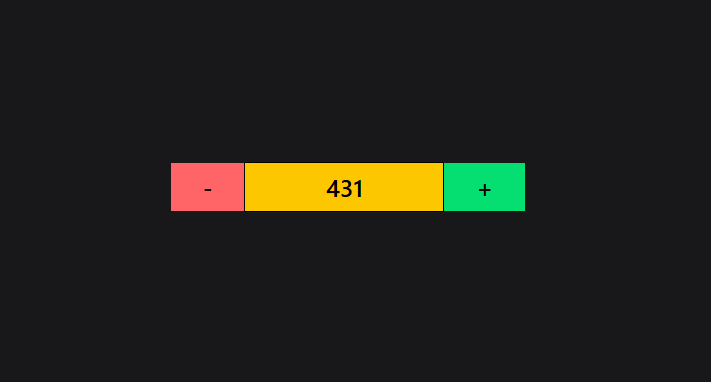

````md
# React useState

## What is useState?

`useState` is a React Hook used to create and manage state inside a functional component.

When state changes, React re-renders the component and updates the UI.

## Syntax

```jsx
import { useState } from "react";

const [state, setState] = useState(initialValue);
````

## Example

```jsx
import { useState } from "react";

function Counter() {
  const [count, setCount] = useState(0);

  return (
    <div>
      <h1>{count}</h1>

      <button onClick={() => setCount(count + 1)}>
        Increase
      </button>
    </div>
  );
}
```

## Understanding the Syntax

```jsx
const [count, setCount] = useState(0);
```
## Example


* `count` → current state value
* `setCount` → function used to update the state
* `0` → initial value

## Common Examples

### String

```jsx
const [name, setName] = useState("");
```

### Boolean

```jsx
const [isOpen, setIsOpen] = useState(false);
```

### Array

```jsx
const [items, setItems] = useState([]);
```

### Object

```jsx
const [user, setUser] = useState({
  name: "",
  age: 0
});
```

## Updating State

```jsx
setCount(10);
```

When the new state depends on the previous state:

```jsx
setCount(prev => prev + 1);
```

## Important Rules

* Import `useState` from React.
* Call Hooks at the top level of the component.
* Don't directly modify state.
* Use the setter function to update state.
* State updates cause the component to re-render.

## Remember

```text
useState
   ↓
Create State
   ↓
Update State
   ↓
React Re-renders
   ↓
UI Updates
```

**useState = State + Setter + Re-render**

```

This is enough for your **learning notes** without making the README unnecessarily long.
```
